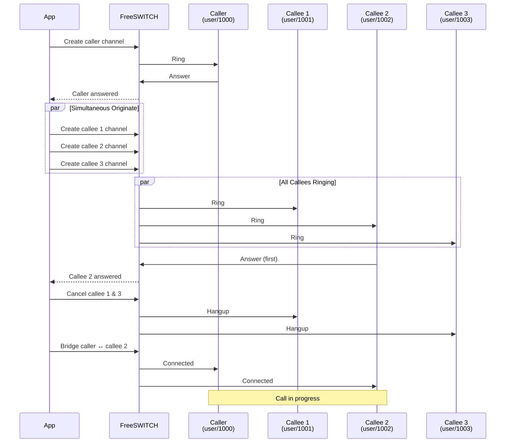

Simultaneous originate example that calls multiple destinations and bridges with the first one to answer.

## Example Code

```python {filename="examples/group_call.py" base_url="https://github.com/Otoru/Genesis/blob/main"}
import asyncio
import os

from genesis import Inbound, RingGroup, RingMode, Channel
from genesis.types import ChannelState

FS_HOST = os.getenv("FS_HOST", "127.0.0.1")
FS_PORT = int(os.getenv("FS_PORT", "8021"))
FS_PASSWORD = os.getenv("FS_PASSWORD", "ClueCon")


async def main() -> None:
    caller_dial_path = "user/1000"
    group = ["user/1001", "user/1002", "user/1003"]

    async with Inbound(FS_HOST, FS_PORT, FS_PASSWORD) as client:
        # Ring group in parallel mode
        answered = await RingGroup.ring(
            client, group, RingMode.PARALLEL, timeout=30.0
        )

        if answered:
            # Create caller channel and bridge with answered callee
            caller = await Channel.create(client, caller_dial_path)
            await caller.wait(ChannelState.EXECUTE)
            await caller.bridge(answered)

            # Handle the call...
            await asyncio.sleep(5)

            # Hang up
            await answered.hangup()
            await caller.hangup()


if __name__ == "__main__":
    asyncio.run(main())
```

## How It Works

This example demonstrates how to use `RingGroup` to implement simultaneous originate:

1. Uses `RingGroup.ring()` with `RingMode.PARALLEL` to call all destinations simultaneously
2. The method automatically waits for the first callee to answer and returns that channel
3. Channels that didn't answer are automatically hung up
4. Creates the caller channel and bridges it with the answered callee

### Ring Modes

`RingGroup` supports two modes:

- **`RingMode.PARALLEL`**: Calls all destinations simultaneously. The first one to answer wins, and all others are automatically hung up.
- **`RingMode.SEQUENTIAL`**: Calls destinations one at a time. Tries the next one only if the current one doesn't answer within the timeout.

### Flow Diagram



This pattern is useful for scenarios like:
- **Ring groups**: Call multiple people at once, connect to whoever answers first
- **Failover**: Try multiple destinations simultaneously, use the first available
- **Load distribution**: Distribute calls across multiple agents

## Running the Example

{}

### 1. Start FreeSWITCH

Make sure FreeSWITCH is running in Docker (see [Examples environment]()).

### 2. Run the Example

```bash
python examples/group_call.py
```

The example will:
- Ring the group `["user/1001", "user/1002", "user/1003"]` in parallel mode
- Wait for the first callee to answer (or timeout after 30 seconds)
- Create and bridge the caller (`user/1000`) with the answered callee
- Hang up all channels after 5 seconds

### 3. Test with Multiple Users

To test this properly, you'll need multiple SIP clients registered:
- User `1000` (caller)
- Users `1001`, `1002`, `1003` (callees)

The first callee to answer will be connected to the caller.

{}
