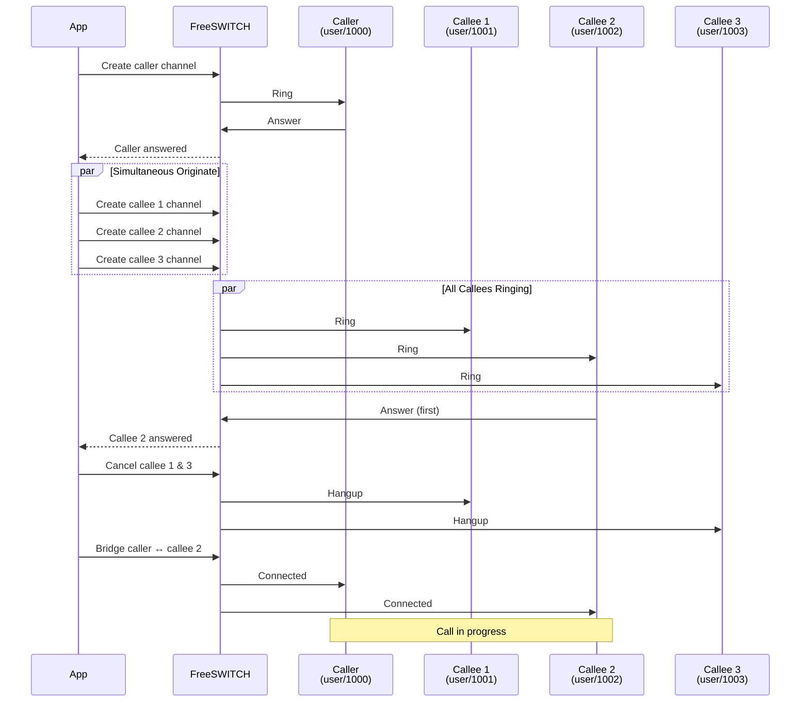

Simultaneous originate example that calls multiple destinations and bridges with the first one to answer.

## Example Code

```python {filename="examples/group_call.py" base_url="https://github.com/Otoru/Genesis/blob/main"}
import asyncio
import os

from genesis import Inbound, RingGroup, RingMode, Channel
from genesis.types import ChannelState

FS_HOST = os.getenv("FS_HOST", "127.0.0.1")
FS_PORT = int(os.getenv("FS_PORT", "8021"))
FS_PASSWORD = os.getenv("FS_PASSWORD", "ClueCon")


async def main() -> None:
    caller_dial_path = "user/1000"
    group = ["user/1001", "user/1002", "user/1003"]

    async with Inbound(FS_HOST, FS_PORT, FS_PASSWORD) as client:
        # Ring group in parallel mode
        answered = await RingGroup.ring(
            client, group, RingMode.PARALLEL, timeout=30.0
        )

        if answered:
            # Create caller channel and bridge with answered callee
            caller = await Channel.create(client, caller_dial_path)
            await caller.wait(ChannelState.EXECUTE)
            await caller.bridge(answered)

            # Handle the call...
            await asyncio.sleep(5)

            # Hang up
            await answered.hangup()
            await caller.hangup()


if __name__ == "__main__":
    asyncio.run(main())
```

## Flow Diagram



## Running the Example

Start FreeSWITCH (see [Examples environment]()) and run:

```bash
python examples/group_call.py
```

The example will ring the group `["user/1001", "user/1002", "user/1003"]` in parallel mode, wait for the first callee to answer, create and bridge the caller (`user/1000`) with the answered callee, then hang up all channels after 5 seconds.

To test this properly, you'll need multiple SIP clients registered: user `1000` (caller) and users `1001`, `1002`, `1003` (callees). The first callee to answer will be connected to the caller.
