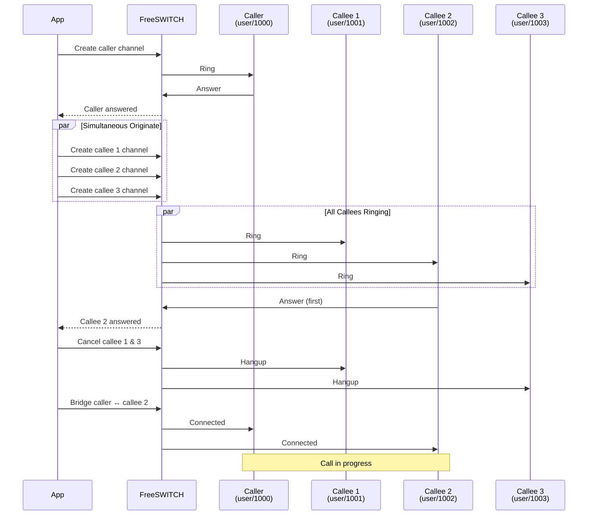

Simultaneous originate example that calls multiple destinations and bridges with the first one to answer.

## Example Code

```python {filename="examples/group_call.py" base_url="https://github.com/Otoru/Genesis/blob/main"}
import asyncio
import os

from genesis import Inbound, Channel
from genesis.types import ChannelState
from genesis.exceptions import TimeoutError

FS_HOST = os.getenv("FS_HOST", "127.0.0.1")
FS_PORT = int(os.getenv("FS_PORT", "8021"))
FS_PASSWORD = os.getenv("FS_PASSWORD", "ClueCon")


async def originate_multiple_simultaneous(
    client: Inbound,
    caller: str,
    callees: list[str],
    timeout: float = 30.0,
) -> tuple[Channel, Channel]:
    """Originate calls simultaneously and return first to answer."""
    # Originate the caller
    caller_ch = await Channel.create(client, caller)
    await caller_ch.wait(ChannelState.EXECUTE, timeout=timeout)

    # Originate the callees
    channels = []
    for callee in callees:
        ch = await Channel.create(client, callee)
        channels.append(ch)

    # Create tasks to wait for the callees to answer
    tasks = {}
    for ch in channels:
        task = asyncio.create_task(ch.wait(ChannelState.EXECUTE, timeout=timeout))
        tasks[task] = ch

    try:
        # Wait for the first callee to answer
        done, pending = await asyncio.wait(
            tasks.keys(), return_when=asyncio.FIRST_COMPLETED, timeout=timeout
        )

        # If no callee answered, raise an error
        if not done:
            raise TimeoutError("No destination answered")

        # Get the first callee to answer
        answered_task = done.pop()
        answered = tasks[answered_task]
        
        # Wait for the task to complete (may raise if it failed)
        await answered_task

        # All pending callee tasks are about to be cancelled and the rest of the channels will be hung up.
        for task in pending:
            task.cancel()
            try:
                await task
            except (asyncio.CancelledError, TimeoutError):
                pass

        for ch in channels:
            if ch == answered:
                continue
            if ch.state >= ChannelState.HANGUP:
                continue
            try:
                await ch.hangup("NORMAL_CLEARING")
            except:
                pass

        return caller_ch, answered

    except Exception:
        for task in tasks:
            task.cancel()
        for ch in channels:
            if ch.state >= ChannelState.HANGUP:
                continue
            try:
                await ch.hangup("NORMAL_CLEARING")
            except:
                pass
        raise


async def main() -> None:
    caller = "user/1000"
    callees = ["user/1001", "user/1002", "user/1003"]

    async with Inbound(FS_HOST, FS_PORT, FS_PASSWORD) as client:
        # Originate the calls
        caller_ch, callee_ch = await originate_multiple_simultaneous(client, caller, callees)

        await caller_ch.bridge(callee_ch)

        # Do something with the call
        await asyncio.sleep(5)

        # Hang up the call
        await callee_ch.hangup()
        await caller_ch.hangup()


if __name__ == "__main__":
    asyncio.run(main())
```

## How It Works

This example demonstrates how to implement simultaneous originate (similar to FreeSWITCH dialplan's loop dial feature) using Genesis:

1. **Originates the caller**: Creates a channel for the person making the call and waits for them to answer
2. **Originates multiple callees**: Creates channels for all destinations simultaneously
3. **Waits for first answer**: Uses `asyncio.wait()` with `FIRST_COMPLETED` to detect which callee answers first
4. **Cleans up**: Cancels pending tasks and hangs up channels that didn't answer
5. **Bridges**: Connects the caller with the first callee to answer

### Flow Diagram



This pattern is useful for scenarios like:
- **Ring groups**: Call multiple people at once, connect to whoever answers first
- **Failover**: Try multiple destinations simultaneously, use the first available
- **Load distribution**: Distribute calls across multiple agents

## Running the Example

{}

### 1. Start FreeSWITCH

Make sure FreeSWITCH is running in Docker (see [Examples environment]()).

### 2. Run the Example

```bash
python examples/group_call.py
```

The example will:
- Originate a call to `user/1000` (caller)
- Simultaneously originate calls to `user/1001`, `user/1002`, and `user/1003` (callees)
- Bridge the caller with the first callee to answer
- Hang up all channels after 5 seconds

### 3. Test with Multiple Users

To test this properly, you'll need multiple SIP clients registered:
- User `1000` (caller)
- Users `1001`, `1002`, `1003` (callees)

The first callee to answer will be connected to the caller.

{}

## Customization

You can customize the example by:

- **Changing destinations**: Modify the `caller` and `callees` variables
- **Adjusting timeout**: Change the `timeout` parameter (default: 30 seconds)
- **Adding error handling**: Handle specific exceptions for different failure scenarios
- **Logging**: Add logging to track which callee answered first

## Similar FreeSWITCH Dialplan

This example replicates the behavior of FreeSWITCH dialplan's simultaneous bridge:

```xml
<action application="bridge" data="user/1001@domain,user/1002@domain,user/1003@domain"/>
```

The comma-separated list tells FreeSWITCH to call all destinations simultaneously and bridge with the first one to answer.
