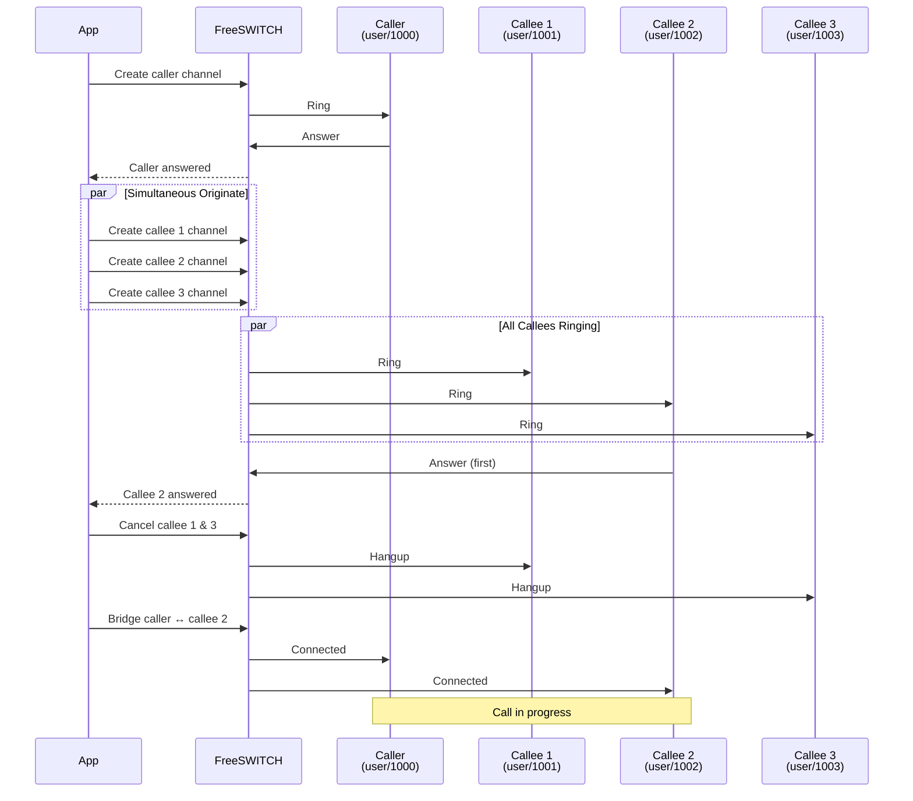

Simultaneous originate example that calls multiple destinations and bridges with the first one to answer.

## Example Code

```python {filename="examples/group_call.py" base_url="https://github.com/Otoru/Genesis/blob/main"}
import asyncio
import os

from genesis import Inbound, RingGroup, RingMode, Channel
from genesis.types import ChannelState

FS_HOST = os.getenv("FS_HOST", "127.0.0.1")
FS_PORT = int(os.getenv("FS_PORT", "8021"))
FS_PASSWORD = os.getenv("FS_PASSWORD", "ClueCon")


async def main() -> None:
    caller_dial_path = "user/1000"
    group = ["user/1001", "user/1002", "user/1003"]

    async with Inbound(FS_HOST, FS_PORT, FS_PASSWORD) as client:
        # Ring group in parallel mode
        answered = await RingGroup.ring(
            client, group, RingMode.PARALLEL, timeout=30.0
        )

        if answered:
            # Create caller channel and bridge with answered callee
            caller = await Channel.create(client, caller_dial_path)
            await caller.wait(ChannelState.EXECUTE)
            await caller.bridge(answered)

            # Handle the call...
            await asyncio.sleep(5)

            # Hang up
            await answered.hangup()
            await caller.hangup()


if __name__ == "__main__":
    asyncio.run(main())
```

## Flow Diagram


```mermaid
sequenceDiagram
    participant App
    participant FreeSWITCH
    participant Caller as Caller<br/>(user/1000)
    participant Callee1 as Callee 1<br/>(user/1001)
    participant Callee2 as Callee 2<br/>(user/1002)
    participant Callee3 as Callee 3<br/>(user/1003)
    
    App->>FreeSWITCH: Create caller channel
    FreeSWITCH->>Caller: Ring
    Caller->>FreeSWITCH: Answer
    FreeSWITCH-->>App: Caller answered
    
    par Simultaneous Originate
        App->>FreeSWITCH: Create callee 1 channel
        App->>FreeSWITCH: Create callee 2 channel
        App->>FreeSWITCH: Create callee 3 channel
    end
    
    par All Callees Ringing
        FreeSWITCH->>Callee1: Ring
        FreeSWITCH->>Callee2: Ring
        FreeSWITCH->>Callee3: Ring
    end
    
    Callee2->>FreeSWITCH: Answer (first)
    FreeSWITCH-->>App: Callee 2 answered
    
    App->>FreeSWITCH: Cancel callee 1 & 3
    FreeSWITCH->>Callee1: Hangup
    FreeSWITCH->>Callee3: Hangup
    
    App->>FreeSWITCH: Bridge caller ↔ callee 2
    FreeSWITCH->>Caller: Connected
    FreeSWITCH->>Callee2: Connected
    Note over Caller,Callee2: Call in progress
```

## Running the Example

{}

### Start FreeSWITCH

Make sure FreeSWITCH is running (see [Examples environment]()).

### Run the example

```bash
python examples/group_call.py
```

### Make test calls

- Register multiple SIP clients: user `1000` , `1001`, `1002` and `1003`.
- Run the example; the first callee to answer is connected to the caller.

### View Logs

To see what's happening in FreeSWITCH:

```bash
docker exec -it genesis-freeswitch fs_cli -x "show channels"
docker logs genesis-freeswitch -f
```

{}
