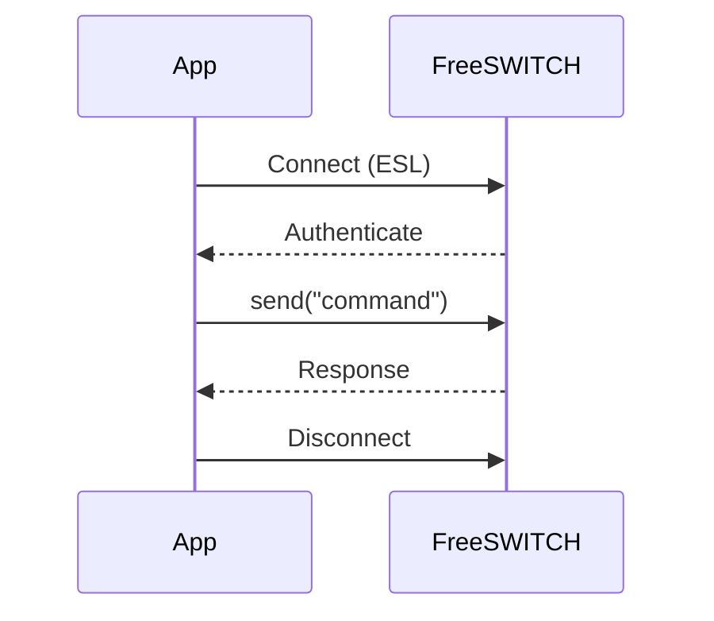

Inbound Socket mode allows you to send commands directly to FreeSWITCH and receive responses asynchronously. This mode is ideal for one-off operations, server queries, and administrative tasks.

## Basic Example

```python
import asyncio
from genesis import Inbound

async def uptime():
    async with Inbound("127.0.0.1", 8021, "ClueCon") as client:
        return await client.send("uptime")

async def main():
    response = await uptime()
    print(response)

asyncio.run(main())
```

## How it works

The `Inbound` class acts as an asynchronous context manager:



{}

### Connection

Establishes a connection to FreeSWITCH at the specified host and port.

### Authentication

Authenticates using the provided password.

### Command Execution

Allows you to send ESL commands using the `send()` method.

### Cleanup

Automatically closes the connection when exiting the context.

{}

## Use Cases

- Querying server status and statistics
- Executing administrative commands
- Triggering actions on FreeSWITCH
- Retrieving channel or call information
- One-time operations that don't require persistent connections
