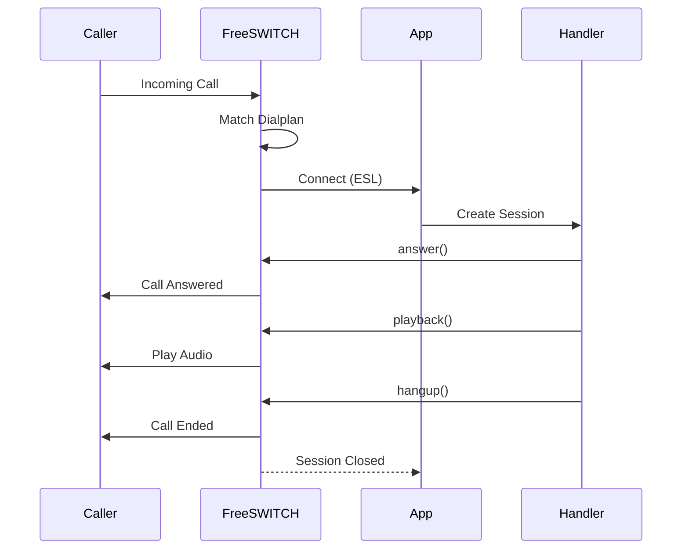

Outbound Socket mode allows you to create dialplan-driven services that control calls in real-time. FreeSWITCH connects to your application when a call matches a dialplan entry, giving you full control over the call flow.

## Basic Example

```python
import asyncio
from genesis import Outbound

async def handler(session):
    await session.channel.answer()
    await session.channel.playback('ivr/ivr-welcome')
    await session.channel.hangup()

app = Outbound(handler, "127.0.0.1", 5000)

asyncio.run(app.start())
```

## Dialplan Configuration


Your FreeSWITCH dialplan must be configured to route calls to your application.


Add an entry to your FreeSWITCH dialplan that routes calls to your application:

```xml
<extension name="outbound-socket">
   <condition>
      <action application="socket" data="127.0.0.1:5000 async full"/>
   </condition>
</extension>
```

## How it works



{}

### Dialplan Match

FreeSWITCH matches a call to your dialplan entry.

### Connection

FreeSWITCH connects to your application at the specified host and port.

### Session Handler

Your handler function receives a `Session` object representing the call.

### Channel Access

Each `Session` has a `channel` attribute that represents the call leg associated with the session. This channel is automatically initialized when FreeSWITCH connects to your application. You use `session.channel` to control the call.

### Call Control

You control the call using `session.channel` methods like `answer()`, `playback()`, `hangup()`, etc.

### Session Lifecycle

The session remains active until the call ends.

{}

## Advanced Example

Building an IVR with `onDTMF()` and `wait()`:

```python
import asyncio
from genesis import Outbound
from genesis.exceptions import TimeoutError

async def handler(session):
    await session.channel.answer()
    
    # Register handlers for each menu option
    @session.channel.onDTMF("1")
    async def option1(dtmf: str):
        await session.channel.playback('ivr/ivr-option-1')
    
    @session.channel.onDTMF("2")
    async def option2(dtmf: str):
        await session.channel.playback('ivr/ivr-option-2')
    
    @session.channel.onDTMF("3")
    async def option3(dtmf: str):
        await session.channel.playback('ivr/ivr-option-3')
    
    @session.channel.onDTMF("4")
    async def option4(dtmf: str):
        await session.channel.playback('ivr/ivr-option-4')
    
    # Play menu prompt
    await session.channel.playback('ivr/ivr-welcome')
    
    # Wait for DTMF input with 10 second timeout
    try:
        await session.channel.wait("DTMF", timeout=10.0)
        # The corresponding handler was already executed automatically
    except TimeoutError:
        await session.channel.playback('ivr/ivr-timeout')
        await session.channel.hangup()

app = Outbound(handler, "127.0.0.1", 5000)
asyncio.run(app.start())
```

## Use Cases

- Interactive Voice Response (IVR) systems
- Call routing and forwarding
- Call recording and monitoring
- Custom call handling logic
- Integration with external services
