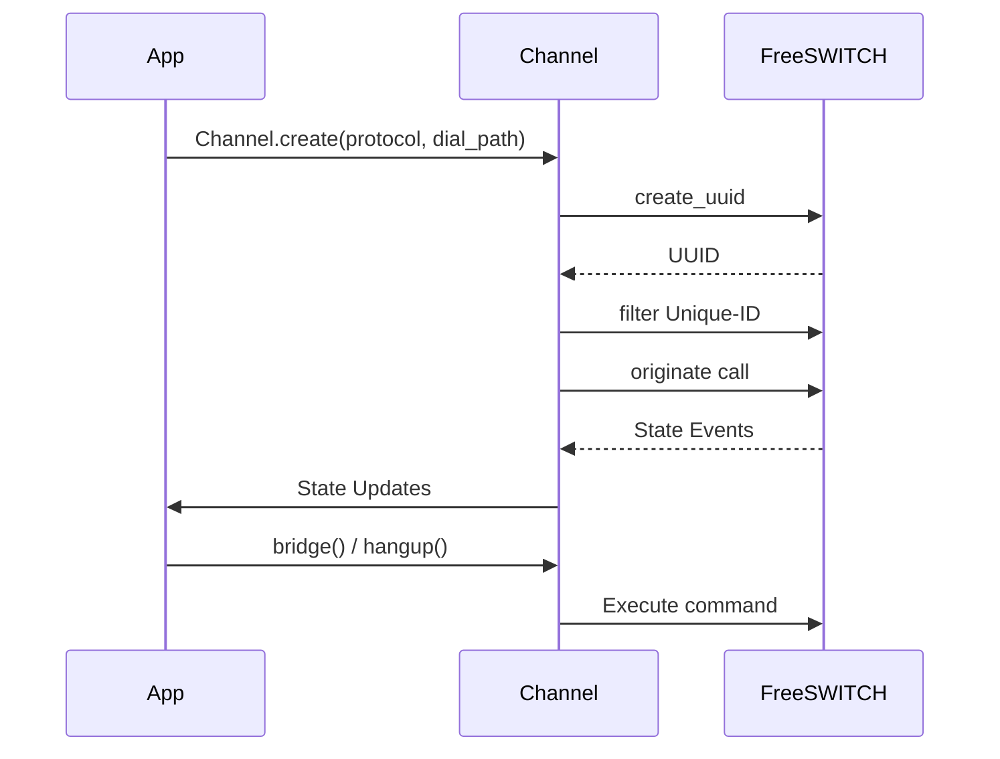

The `Channel` class provides a high-level abstraction for creating and managing FreeSWITCH channels (legs). It simplifies outbound call origination, state tracking, and bridging operations.

## Overview

A `Channel` represents a single call leg in FreeSWITCH. It can be used with both `Inbound` and `Outbound` modes. 

In `Outbound` mode, each `Session` automatically has a `channel` attribute that represents the call leg associated with that session. You can access it via `session.channel` to control the call.

Since `Session` (used in Outbound mode) inherits from `Protocol`, you can also create additional channels directly from a `Session` without needing a separate `Inbound` connection.

## Basic Example

```python
import asyncio
from genesis import Inbound, Channel

async def make_call():
    async with Inbound("127.0.0.1", 8021, "ClueCon") as client:
        # Create a channel to call user/1000
        channel = await Channel.create(client, "user/1000")
        
        # Channel is now being created and originated
        print(f"Channel UUID: {channel.uuid}")
        print(f"Channel state: {channel.state}")
        
        # Hangup the call
        await channel.hangup()

asyncio.run(make_call())
```

## How it works

{}

### Create Channel

Use `Channel.create()` to instantiate a new channel. This method:
- Generates a UUID for the channel
- Subscribes to channel state events
- Filters events for this specific channel
- Originates the call to the specified dial path

You can pass custom variables to the originate command using the `variables` parameter:

### State Tracking

The channel automatically tracks its state through FreeSWITCH events. The state is read-only and updated automatically as the channel progresses through its lifecycle.

### Channel Lifecycle

Channels progress through states: `NEW` → `INIT` → `ROUTING` → `EXECUTE` → `HANGUP` → `DESTROY`

{}

## Custom Variables

You can pass custom variables to the originate command using the `variables` parameter. These variables are added to the originate options and can be used to configure caller ID, custom headers, or any other FreeSWITCH originate variables.

**Note:** Custom variables cannot override default variables (`origination_uuid` and `return_ring_ready`).

```python
# Set caller ID number and name
channel = await Channel.create(
    client,
    "user/1000",
    variables={
        "origination_caller_id_number": "11999999999",
        "origination_caller_id_name": "My Company"
    }
)
```

Common variables you might want to set:
- `origination_caller_id_number` - Caller ID number (bina)
- `origination_caller_id_name` - Caller ID name
- `ignore_early_media` - Ignore early media
- `continue_on_fail` - Continue on failure
- Any other FreeSWITCH originate variable

## Channel States

The `ChannelState` enum represents the lifecycle of a channel:

- **NEW** - Channel just created
- **INIT** - Channel initializing
- **ROUTING** - Channel being routed
- **EXECUTE** - Channel executing dialplan
- **EXCHANGE_MEDIA** - Media exchange in progress
- **PARK** - Channel parked
- **HANGUP** - Channel hanging up
- **DESTROY** - Channel destroyed

You can check the current state using the `state` property:

```python
channel = await Channel.create(client, "user/1000")

if channel.state == ChannelState.EXECUTE:
    print("Channel is active")
elif channel.state >= ChannelState.HANGUP:
    print("Channel is ending")
```

## Bridging Channels

You can bridge a channel with another channel or with an active `Session`:

### Bridge Two Channels

```python
async with Inbound("127.0.0.1", 8021, "ClueCon") as client:
    # Create two channels
    channel_a = await Channel.create(client, "user/1000")
    channel_b = await Channel.create(client, "user/2000")
    
    # Bridge them together
    await channel_a.bridge(channel_b)
```

### Bridge Channel with Session

```python
from genesis import Outbound, Session, Channel

async def handler(session: Session):
    await session.channel.answer()
    
    # Create a channel using the session as protocol
    channel = await Channel.create(session, "user/1000")
    
    # Bridge the session channel with the new channel
    await session.channel.bridge(channel)
    
    # Both parties are now connected

app = Outbound(handler, "127.0.0.1", 5000)
```

## Handling DTMF Input

The `onDTMF()` decorator allows you to handle DTMF (touch-tone) input from the caller. You can register handlers for specific digits or a wildcard handler for any digit.

### Basic Usage

```python
from genesis import Outbound, Session

async def handler(session: Session):
    await session.channel.answer()
    
    # Handle specific digit
    @session.channel.onDTMF("1")
    async def on_one(digit: str) -> None:
        await session.channel.say("1", lang="en", kind="NUMBER")
    
    # Handle any digit (wildcard)
    @session.channel.onDTMF()
    async def on_any_digit(digit: str) -> None:
        print(f"Received DTMF: {digit}")
        await session.channel.say(digit, lang="en", kind="NUMBER")
    
    # Keep the call alive
    await asyncio.sleep(30)

app = Outbound(handler, "127.0.0.1", 5000)
```

### Multiple Handlers

You can register multiple handlers for different digits:

```python
@session.channel.onDTMF("1")
async def handle_option_one(digit: str) -> None:
    await session.channel.playback("ivr/8000/ivr-option.wav")
    await session.channel.say("1", lang="en", kind="NUMBER")

@session.channel.onDTMF("2")
async def handle_option_two(digit: str) -> None:
    await session.channel.playback("ivr/8000/ivr-option.wav")
    await session.channel.say("2", lang="en", kind="NUMBER")

@session.channel.onDTMF("0")
async def handle_exit(digit: str) -> None:
    await session.channel.hangup()
```

### Wildcard Handler

A handler without arguments will catch all DTMF digits that don't have a specific handler:

```python
@session.channel.onDTMF()
async def handle_any_dtmf(digit: str) -> None:
    if digit not in ["1", "2", "3", "0"]:
        await session.channel.playback("ivr/8000/ivr-that_was_an_invalid_entry.wav")
```

**Note:** Specific handlers (e.g., `onDTMF("1")`) take precedence over the wildcard handler.

## Hanging Up

Terminate a channel using the `hangup()` method:

```python
# Normal hangup
await channel.hangup()

# Hangup with specific cause
await channel.hangup("USER_BUSY")
```

Available hangup causes include: `NORMAL_CLEARING`, `USER_BUSY`, `NO_ANSWER`, `CALL_REJECTED`, and many others.

## Channel Creation Flow



## Advanced Example

Forwarding an incoming call to another destination:

```python
import asyncio
from genesis import Channel, Outbound, Session

async def handler(session: Session):
    await session.channel.answer()
    await session.channel.playback('ivr/ivr-please-hold')
    
    # Create a channel using the session as protocol
    forward_channel = await Channel.create(session, "user/1000")
    
    # Bridge the session channel with the forward channel
    await session.channel.bridge(forward_channel)
    # Both parties are now connected

app = Outbound(handler, "127.0.0.1", 5000)
asyncio.run(app.start())
```

## Use Cases

- **Outbound calling** - Initiate calls from your application
- **Call routing** - Route calls between different endpoints
- **Call centers** - Bridge customers with agents
- **Call forwarding** - Forward calls to different destinations
- **Conference bridges** - Connect multiple parties
- **IVR outbound** - Make outbound calls with IVR functionality
