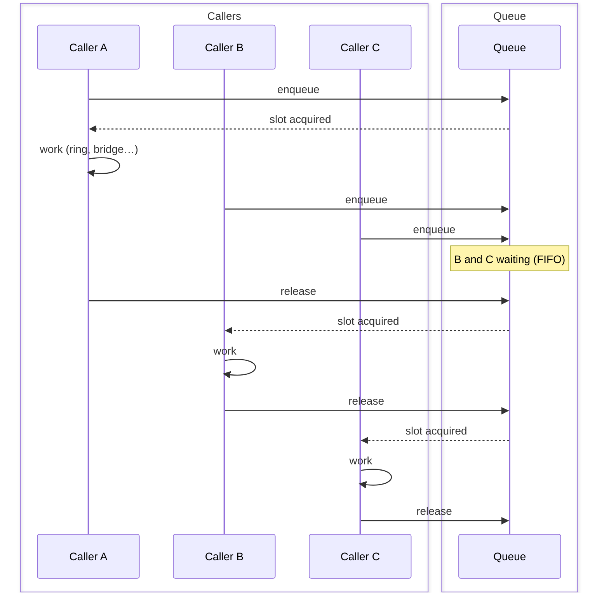

The queue abstraction lets you limit concurrency per logical queue and process callers in FIFO order. It uses a **context manager** and **semaphore-like** API: you enter a slot, do your work, and release on exit.

## Overview

Use the queue when you want to:

- Enqueue calls and process them one (or N) at a time per queue
- Control how many calls are "inside" a given flow at once (e.g. one at a time for a ring group)
- Share queue state across app instances via Redis when scaling out

The queue is **generic**: it does not know about ring groups or FreeSWITCH. You use it to acquire a "slot" (FIFO + concurrency limit); what you do inside the slot (ring group, IVR, etc.) is up to you.

## Flow

With `max_concurrent=1`, only one caller holds the slot at a time. Others wait in FIFO order and acquire when the slot is released:



- **Enqueue**: On `slot(...)` enter, you join the queue (FIFO). You block until you are at the head and a slot is free.
- **Slot acquired**: You run your code (e.g. ring group, bridge). With `max_concurrent=1`, only one caller is in this phase at a time.
- **Release**: On exit, you free the slot; the next caller in line acquires it.

With `max_concurrent=2`, two callers can hold a slot at once; the rest wait in line.

## Basic Example

```python
import asyncio
from genesis import Outbound, Session, Queue, RingGroup, RingMode

queue = Queue()  # in-memory by default

async def handler(session: Session):
    # Only one call at a time in "sales" queue; others wait in line
    async with queue.slot("sales"):
        answered = await RingGroup.ring(
            session,
            ["user/1001", "user/1002"],
            RingMode.PARALLEL,
            timeout=30.0,
        )
        if answered:
            await session.channel.bridge(answered)

app = Outbound(handler, "127.0.0.1", 9000)
asyncio.run(app.start())
```

## API

### `queue.slot()`

Use `async with queue.slot(...)` to acquire a slot and release it when the block ends.

- **Enter**: enqueues this call, then blocks until it is at the head of the queue and a slot is free
- **Exit**: releases the slot so the next caller can proceed

```python
async with queue.slot("sales"):
    # do work
    pass

# With explicit item_id (e.g. for Redis / tracing)
async with queue.slot("sales", item_id=session.uuid):
    pass

# Allow 2 concurrent
async with queue.slot("support", max_concurrent=2):
    pass

# Optional timeout: raise QueueTimeoutError if not acquired in 30s
try:
    async with queue.slot("sales", timeout=30.0):
        # do work
        pass
except QueueTimeoutError:
    # Caller waited too long; item was removed from queue
    pass
```

### `queue.semaphore()`

Returns a reusable object you can use as a context manager. Same semantics as a slot, but you can keep a reference and use it in several places.

```python
sem = queue.semaphore("support", max_concurrent=2)

async with sem:
    # do work
    pass

# Optional: pass item_id when used as callable
async with sem(item_id=session.uuid):
    pass
```

For in-memory and Redis, see [Backends]().

## Parameters

**`queue.slot(queue_id, *, item_id=None, max_concurrent=1, timeout=None)`**

- `queue_id`: Logical queue name (e.g. `"sales"`, `"support"`)
- `item_id`: Optional identifier for this entry (e.g. `session.uuid`). If omitted, a UUID is generated. Useful with Redis for tracing
- `max_concurrent`: Maximum number of callers allowed inside this queue at once. First use for a given `queue_id` sets this for that queue in the backend
- `timeout`: Optional seconds to wait for a slot. If the wait exceeds this, the item is removed from the queue and :exc:`genesis.exceptions.QueueTimeoutError` is raised

**`queue.semaphore(queue_id, max_concurrent=1, timeout=None)`**

- `queue_id`: Name of the queue
- `max_concurrent`: Max concurrent slots when using this semaphore
- `timeout`: Optional seconds per acquire

## Timeout

You can pass **`timeout`** (seconds) to `queue.slot()` or `queue.semaphore()` so that if the caller does not get a slot within that time, the wait is aborted instead of blocking indefinitely.

- **Behavior**<br />The timeout covers both (1) waiting for your turn in the FIFO queue and (2) waiting for a free concurrency slot. If the time is exceeded, your entry is removed from the queue and the next caller can proceed.
- **Exception**<br />:exc:`genesis.exceptions.QueueTimeoutError` is raised. Handle it to e.g. play a message and hang up.
- **Use case**: Avoid callers waiting forever when the queue is congested; after a limit (e.g. 60 seconds), you can play "all agents are busy" and disconnect.

## Use Cases

- **Ring group with one call at a time**: use a single slot per queue so only one caller is "in" the ring group at once; others wait in line
- **Bounded concurrency**: use `max_concurrent > 1` to allow N calls in the same flow (e.g. support pool)
- **Scaling**: use `RedisBackend` so several app instances share the same queue and respect global order and limits

## Observability

The queue reports:

- **Metrics**: `genesis.queue.operations` (acquire/release counts), `genesis.queue.wait_duration` (time waiting for a slot)
- **Tracing**: spans for `queue.wait_and_acquire` with attributes `queue.id` and `queue.item_id`

## Related

- [Backends]() - In-memory and Redis
- [Ring Group]() - Often used inside a queue slot to ring agents
- [Outbound Socket]() - Typical place to use the queue in the session handler
- [Queue Example]() - Full runnable example
